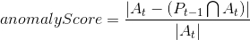
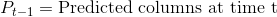
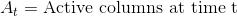
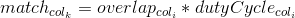
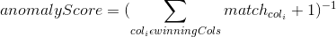

# Anomaly Detection

This technical note describes how the anomaly score is implemented and incorporated into the CLA (Cortical Learning Algorithm).

The anomaly score enables the CLA to provide a metric representing the degree to which each record is predictable. For example, if you have temporal anomaly model that is predicting the energy consumption of a building, each record will have an anomaly score between zero and one.  A zero represents a completely predicted value whereas a one represents a completely anomalous value.

The anomaly score feature of CLA is implemented on top of the core spatial and temporal memory, and don’t require any spatial pooler and temporal memory algorithm changes.

## TemporalAnomaly model

### Description

The user must specify the model as a TemporalAnomaly type to have the model report the anomaly score. The anomaly score uses the temporal memory to detect novel points in sequences. This will detect both novel input patterns (because they have not been seen in any sequence) as well as old spatial patterns that occur in a novel context.

### Computation

A TemporalAnomaly model calculates the anomaly score based on the correctness of the previous prediction. This is calculated as the percentage of active spatial pooler columns that were incorrectly predicted by the temporal memory.

The algorithm for the anomaly score is as follows:

__Note__: Here, a "predicted column" is a column with a non-zero confidence value. This is not exactly the same as having a cell in the predicted state. For more information, refer the "predicted cells vs. confidences" section below.

Thus, an anomaly score of 1 means that no predicted cells became active and represents a completely anomalous record. A score of 0 means all predicted cells became active and represents a completely predicted record.

### Rationale

The reasoning behind this formulation of the anomaly score was that any record that is not predicted is a novel record. This holds if we have built the best predictive model possible, which we assume we have done via training/swarming.

### Results

This anomaly score has been applied to many datasets. It is the core mechanism used in Numenta's commercial product Grok. In some cases you need to take a moving average of the anomaly score rather than just looking at the raw anomaly score. In NuPIC the example `examples/opf/clients/hotgym_anomaly` provides a good starting point to anomaly detection.  See also [this set of examples](https://github.com/subutai/nupic.subutai/tree/master/swarm_examples) for swarming with anomaly detection models.

### Confidences vs. Predicted Cells

#### Description

To compute the temporal anomaly score, the intention was to compute a normalized count of how many columns were active and not predicted. As an implementation shortcut, the set of predicted columns was computed by looking at columns with non-zero column "confidences."

However, it was later discovered that columns with non-zero confidences don’t necessarily have any predicted cells in them. To figure out if a cell is in the predicted state, we use the hard match count (the number of active synapses, after taking into account the permanence threshold). However, to compute the confidences for a cell, the Temporal Pooler uses the soft match count (the number of active synapses, regardless of the permanence values). Therefore, the set of columns with non-zero confidences will always be a superset of the columns containing predicted cells.

When this difference was discovered (~April 2013), an option was added to the CLA to compute the anomaly score based on the predicted cells rather than using confidences.

#### Results

Some experiments using the predicted cells to compute the anomaly score were run on some experiments. However, because these predictions are a subset of the columns with non-zero confidences, the results necessarily had more false positives. As of the time of writing, no change has been made to the computation of the anomaly score based on these results. The anomaly score is still computed using column confidences.

## Non-Temporal Anomaly Detection

### Description

There were also some attempts at adding anomaly detection that are "non-temporal" in nature by using the state of the spatial pooler. A non-temporal anomaly is defined as a combination of fields that doesn’t usually occur, independent of the history of the data.

### Computation

Since NontemporalAnomaly models have no temporal memory, the anomaly score is based on the state within the spatial pooler.  

To compute the nontemporal anomaly score, we first compute the "match" score for each winning column after inhibition

Then, to get the anomaly score (how unusual the data is), we take the inverse of the total matches

The addition of 1 is to avoid divide by 0 errors.

### Rationale

The purpose of this anomaly score was to detect input records that represented novel or rare input patterns (independent of the rest of the sequence). If an input pattern has a low overlap score with the winning columns, none of the columns match the input very well, indicating that the CLA has not seen a similar pattern before and this pattern is novel. Conversely, if they duty cycles for a given pattern are generally low, this indicates that a pattern has not been seen for a long time, indicating that it is rare.

### Results

This algorithm was run on some artificial datasets. However, the results were not very promising, and this approach was abandoned. From a theoretical perspective the temporal anomaly detection technique is a superset of this technique. If a static pattern by itself is novel, by definition the temporal memory won't make good predictions and hence the temporal anomaly score should be high. As such there was not too much interest in pursuing this route.
