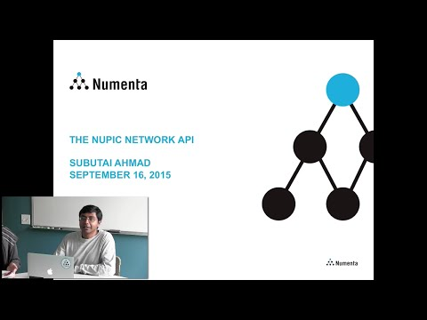

# Network API Guide

* [Network API Documentation](../api/network/)
* [Network API Quick Start](../quick-start/network.html)

[](https://www.youtube.com/watch?v=g9yS9zFt3dM)

## Introduction

The Numenta Platform for Intelligent Computing (NuPIC) allows programmers to design, create, train, test, and deploy Hierarchical Temporary Memory (HTM) technology for streaming data.
NuPIC consists of a Network Engine library along with layered software including examples and frameworks.
Core HTM functionality is provided by the Network Engine, which can create and manipulate HTM Networks.

## Goals and Technical Requirements

An HTM Network is a collection of Regions that implement HTM algorithms and other algorithms.
The Network Engine allows users to create and manipulate HTM Networks, including:

-	Creating, saving, and loading networks
-	Configuring networks
-	Running networks
-	Querying networks

The design goals of the Network Engine were:

-	Provide all essential functionality for using HTM Networks, but no more.
Additional functionality will be provided by layered libraries.
-	Excellent performance.
The Network Engine should add negligible overhead.
-	Easy to understand and use.
The API should be consistent and easy to learn; it should not use fancy or obscure language features.
-	Clean architecture and transparent behavior.
A "Network" is a Network, not a proxy; no asynchronous operation; exceptions propagate directly to the caller and the call stack is visible and comprehensible.
-	Easy to add support for new algorithms.
Modular architecture for algorithms; isolate algorithm developers from needing to know much about Network Engine internals.

## Overview of the Network Engine

### Network Structure

The key structural features of this network are:
-	A network is composed of zero or more named regions.
-	A region has zero or more named inputs and zero or more named outputs.
-	The output of one region may be connected to the input of another region with a link.
While the figure does not show it, an input may be linked to multiple outputs and vice-versa.

### Object Model

The Network Engine is a library written in C++, using an object-oriented design.

The Network Engine defines a class corresponding to each of the components shown in Figure 1.
Each of these is discussed in more detail in the next section:
-	Network
-	Region
-	Input
-	Output
-	Link

Additionally, the `RegionImpl` class provides a base class for different region types (each of which can implement a separate algorithm).
The `LinkPolicy` class provides a base class for different link behaviors.

A few other auxiliary classes are present in the API, including `NodeSpec`, `Collections`, and `Dimensions`.

Note: As of 10/2010, a Region is logically a collection of one or more nodes, and there is a corresponding node class.
It is possible that we will remove nodes from the object model.
Because of this, nodes and region functionality related to nodes are not described in this document.

### Internal and External API

NuPIC users access the Network Engine through the Core API.
The Core API does not include the full object model.
Only the Network and Region classes are exposed to users, and only a subset of their methods ("public external" methods, as described below) is seen by users.
Other classes and methods are only used internally by the Network Engine.
The details of how methods are selectively exposed in the Core API are described in the Language Bindings Design document.

There are three types of methods in the Network Engine object model.

-	Public/external methods are declared "public" in the C++ definition and are exposed in the Core API. They are also called internally within the Network Engine.
-	Public/internal methods are declared "public" in the C++ definition and are not exposed in the Core API. They are used internally by other classes within the Network Engine.
-	Private methods are declared "private" in the C++ definition and are only available to the class for which they are defined.

## Network Engine Classes

This section gives an overview of each important class.
It assumes that the reader has access to header and implementation files in `nta/*`.

###	Network

Network is the "root" object in the Network Engine.
All other objects are contained within a Network object, either directly or indirectly.
A Network can be saved to a network bundle, loaded from a network bundle, or constructed programmatically (see "Network Serialization", below).
All of the Network public API is also external.
There are no public/internal methods.

Conceptually, a network is just a container of regions, with links between those regions.
A network can be constructed programmatically by adding regions with `addRegion()` and linking them together with link().

The main data members of Network are a Collection of Regions, and a data structure that contains a set of regions at each phase.
The Network owns the Regions, which are destroyed in the Network destructor.
This is really all there is to it.
Some components in Figure 1 you might expect to be contained directly by Network, but are not.
As described below, Region Inputs and Outputs are owned by Region; Links are owned by Region inputs.

A Network must be initialized before it can run. Network initialization can be explicit but is usually done implicitly when `run()` is called.
Initialization is discussed in more detail in the "Initialization" section below.

Two pieces of information replicated between the Network and its contained regions.
The first is the region name, which is needed by the region to be able to produce good error messages.
It also appears as the key in the Network's Region collection, where it is used to retrieve a Region by name.
The second is the phase information, which the network stores in a way that allows it so quickly select all regions at a given phase, and which the Region stores to facilitate serialization.
The network controls both pieces of information, and there is no public/external API on Region to set the name or phase of a Region.

###	Region

A Region is the fundamental computational unit in an HTM.
A Region has inputs and outputs, and has a `compute()` method that generates the outputs (from inputs, internal state, and perhaps external data sources, such as a file).
A Region without inputs is known as a sensor, and a Region without outputs is known as an effector.
A Region owns its inputs and outputs, and is responsible for choreographing their initialization.

A Region caches the following values.
These values are not needed for any computation.

-	name -- needed for good error messages
-	network -- needed by inspectors that start with one region but can open inspectors for other regions
-	phase -- needed for serialization (more convenient to store with the region than with the network) and `region.getPhases()`

Most of the real work of a Region (`compute()` and `execute()` methods, getting and setting parameters) is delegated to a `RegionImpl`.
Each Region contains a single `RegionImpl`, which is gets from the `RegionImplFactory`.
A `RegionImpl` determines what inputs, outputs, and parameters a Region has.

The Region can profile itself, recording accumulated time in `compute()` and in `execute()` methods.

Each Region has a set of `setParameter`/`getParameter` methods.
These methods are typed (e.g. `getParameterInt32`) but not templated for several interacting reasons.
They are typed because a typed interface is much faster than an untyped interface (as in NuPIC 1) in which all values are converted to/from strings.
The typed methods could have been overloaded (for `setParameter` only) but SWIG generates very slow code in this case.
They could not be templated because they are passed through to `RegionImpl`, and templated methods on `RegionImpl` could not be overridden by subclasses (which is the whole point).

The `prepareInputs()` method of Region evaluates all of the incoming links and copies necessary data into each of the Region's inputs.

###	RegionImpl

The `RegionImpl` does all of the algorithm-specific work of a Region.
It is a base class from which the actual algorithm-specific class is derived.
Region types implemented in C++ are derived directly from `RegionImpl`.
The `PyNodeBase` class, which can load any Region type defined in Python, is also derived from `RegionImpl`.

All of the setup of inputs and outputs is done by the Region container.
This allows `RegionImpl` to focus on computation and parameter management.

A call to `Network::run()` goes to `Region::compute()` and then to `RegionImpl::compute()` --
these will all be visible in a stack trace from inside `RegionImpl::compute()`.
In this sense, network computation is transparent, which was one of the design goals --
there are no proxies and no asynchronous behavior (unlike in the previous version of NuPIC).

The `RegionImpl` supplies (via a class method) the RegionSpec for the type of Region it implements.
The `RegionSpec` includes a list of inputs, outputs, parameters, and execute methods.

###	Output

An Output is essentially a contiguous buffer of typed data (in the `data_` member), plus a list of Links whose source is that Output.
The buffer is not allocated when the Output is created, but in the `initialize()` method, which is called (indirectly) at Network initialization time.

Output objects are allocated in the Region constructor, which creates an Output for each output specified in the `RegionSpec`.

The size of the Output buffer is specified by the `RegionImpl` (via `getNodeOutputElementCount`), i.e.:

-	Region creates Output.
-	Region creates `RegionImpl`.
-	Region queries `RegionImpl` for output buffer size.
-	During initialization, Region asks Output to allocate buffer of given size.

(Note: currently, the output size is calculated from the `NodeOutputElementCount` times the number of nodes in the Region.
If we move to one node per Region, the output size will be given directly by the `RegionImpl`).

The Output has a list of pointers to Links for which it is the source, but it does not own those links (links are owned by the Input on the other side).

###	Input

An Input has similar structure to an Output --
it has a contiguous buffer of typed data, plus a list of Links whose destination is that Input.
Input objects are allocated in the Region constructor, which creates an Input for each input specified in the RegionSpec.

The size of the Input buffer is determined by the incoming links --
it is the sum of the sizes of connected Output buffers.
The buffer is allocated in the last phase of network initialization, after Output buffers are allocated.

The Input has a list of pointers to Links for which it is the destination.
The Input is the owner of those Links, and the Links are deallocated in the Input destructor.
The order of links matters, as this determines how output data is mapped into the input buffer.

The Input design anticipates a future "zero copy" optimization for inputs.
Currently, data is always copied from the source Output into the destination Input.
If an Input has only a single incoming Link, then there is a one-to-one mapping between an Output and Input, and the Input buffer can simply be a pointer to the linked Output buffer.
This optimization is deferred until there is a demonstrated need.

### Link

A Link is logically a connection from a source region’s Output to a destination region’s Input. Your application is created by declaring the functional building block (the regions), giving those regions the parameters that dictate their behavior, and then connecting them up with links that determine how data (normally SDR’s) will flow between your regions.

Each region implementation maintains a Spec structure which, along with the parameter definitions, defines each input data flow it expects and each data output it will generate. Each Output node and each Input node are the ends of a Link and each represent a buffer of data.

Some destination Inputs declared in the Spec are optional. But at runtime, those nodes specified as required must have a Link generated for them before the network’s initialization() function is called. It is at initialization time that the links are analyzed to determine if everything is consistent, determines buffer sizes and type, allocates the input and output buffers, creates the linking pointers, and determines the execution phases. The phases determine the order in which the Network will execute the regions such that the data smoothly flows from source to destination along the line of execution.

Each time the network performs a run cycle, it will do the following:

1. Copy one buffer full of data from the Output node on the source to the Input buffer on the destination region for each link feeding that region.
1. Execute the region.
1. Then repeat for the next region until all regions have been executed in the order of the phases.

Declaration of Outputs and Inputs: In the Spec, each Output and Input definition has a unique name which identifies the node within the region. So a node is then uniquely identified by the Output/Input node name and the name of the region on which it resides. A Link is then created by calling `Network.link()` with the names of the source and destination regions and the names of the Output and Input nodes (along with `LinkType` and `LinkParams`). Note that the Output node or Input node names may be omitted from the call if they are the ones configured as the Default Output or Default Input respectively for their regions.

Data Type: The definitions in the Spec for each Output and Input will declare the data type that is expected or generated. The data types MUST be the same on both ends of a link so they are normally set to `NTA_BasicType_Real32` which is somewhat universal. Often the data is actually an SDR which is just 1’s and 0’s but they are converted to the specified type to traverse the link.

Dimensions: The dimensions feature provided in the HTM engine was a means of defining a multidimensional array structure of buffers for Links. This feature is obsolete. Most region implementations set the field `singleNodeOnly=true` at the top of the Spec. This implies a fixed dimension of [1]. This means that an output has only one buffer and it is connected to a single input buffer with one-to-one mapping.
If a region still requires a dimension, specify a single dimension of [1].

Source Output Buffer width: The buffer width for any Output of any region can be defined in the corresponding Output definition in the Spec of the source region’s implementation (the ‘count’ field). However if this is 0 (and it most often is) then check the other end of the link, check the ‘count’ field of the Spec Input definition of the destination region’s implementation. If that is also 0 (and it most often is) then the width is determined by asking the source region’s implementation what it intends to generate by calling the required function `getNodeOutputElementCount()`. If this should return a 0, then the buffer width cannot be determined and an error is generated.

Destination Input Buffer width: The input buffer width is set using the
width of the source output buffer to which it is connected.  If more than
one link terminate on the same Input buffer, the input buffer width is set
using the sum of the widths of all source output buffers that are connected.

Normally the links are configured such that an output from the source region is fed directly into the input of a destination region. However, an Output may be connected to multiple Inputs and an Input may fed by multiple Outputs. This is determined by the Links that are created.

If multiple source Outputs are fed into a single destination Input, the Input buffer is essentially a concatenation of data from all connected source output buffers, concatenated in the order that the links were created. The link keeps track of its offset where it should put its contribution within the destination input buffer. The destination region just sees this wide buffer for its input.

Link Delays: Or Propagation Delay is a feature which delays sending output buffers of data over the link for a specified number of time steps (number of network run iterations). At each time step the output is pushed into the bottom of the queue and the buffer at the top of the queue is sent. The delay buffers, if any, are initially populated with 0’s. This feature is specified by setting the ‘propagationDelay’ parameter of the Spatial Pooler.

`LinkType` and `LinkPolicy`: Originally the `LinkType` and `LinkPolicy` arguments to the `network::Link()` function controlled how a structure of buffers were distributed among multiple Output and multiple Input nodes over a single link between two regions. Now that each region has only one Input node and one Output node per link this no longer is used. So for all links use a link type of “UniformLink” and a link policy of “” which means just copy the source Output buffer to the destination Input buffer. Things like `TestFanIn2` link policy, Splitter Maps and Region Level vs Node Level are all obsolete.

###	Collection

A Collection is a templatized container used throughout the API instead of STL containers.
It is easy to wrap, because its interface is simpler than an STL interface, and it provides a consistent way to access collections of objects.
A container provides lookup by name and index.
In the external API, a container is always read-only.

## Specific topics

###	Network serialization

Networks are serialized into a "bundle", which is a directory with several files.
Automatic Zip support (so that the network bundle can be distributed as a single file) is anticipated, but won't be implemented until there is a demonstrated need.

Each network bundle contains:

-	A network structure file, network.yaml. This is a YAML-formatted file that specifies all of the regions and links in the file, but not the internal (`RegionImpl`) state of a region.

-	One or more files for each `RegionImpl`, containing the state of the `RegionImpl`. For regions implemented in Python, this is usually the pickled state of the region. (Network bundles containing such pickled state cannot be safely shared because they essentially contain arbitrary code). The state of the first region is saved in files with a prefix "R0-"; the state of the next region is saved in files with the prefix "R1-", and so on. The region name is not part of the filename, so that region names are not restricted to names allowed by the filesystem.

Network serialization proceeds as follows:

- The Network serializes its structure to the network.yaml file.
-	Iterates through its Regions, asking them to serialize their state (exclusive of `RegionImpl` state).
-	Iterations through all of the links on all of the inputs on all of the regions, asking them to serialize their state.
- The Network asks each region to serialize its `RegionImpl` state to the bundle.

Network de-serialization is the reverse of the serialization process.

###	Network initialization

Network initialization involves a complicated choreography.
Much of the complication is related to inducing dimensions on Regions and making sure that all dimensions are consistent.
That part of network initialization is not described here because Region dimensions may be removed from the API.

0. (not described). Determine the dimensions of each Region through an iterative process of link evaluation.
1. Allocate all Ouput buffers. Each Region has enough information to figure out the size of its outputs.
2. Allocate all Input buffers. For each Input, the buffer size is determined by examining the incoming links and summing their source output sizes.
3. Initialize the RegionImpl in each Region. The `RegionImpl` is given pointers to its input and output buffers, which it can safely cache.
4. Set the minimum and maximum enabled phase for the Network.

###	Running a network

The main job of a Network is to choreograph Region computation by calling Region `compute()` methods in the right order.
The network associates with each region a list of one or more integer phases.
The method `run(n)` is best shown by pseudocode:

```
for iteration in (1, …, n):
  for phase in (minPhase, …, maxPhase):
    for each region associated with this phase:
      region.prepareInputs()
      region.compute()
  invoke all network callbacks
```

A network callback is an arbitrary user-specified function that is called at every network iteration.
An arbitrary number of network callbacks may be attached to a Network.
Callbacks allow us to add functionality (such as watchers) without changing or expanding the Core API.
