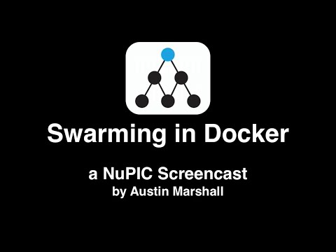

# Guide to Running Swarms

This document contains detailed instructions for configuring and running swarms. Please see the document [Swarming Algorithm](Swarming-Algorithm) for a description of the underlying swarming algorithm.

Swarming is a process that automatically determines the best model for a given dataset. By "best", we mean the model that most accurately produces the desired output. Swarming figures out which optional components should go into a model (encoders, spatial pooler, temporal memory, classifier, etc.), as well as the best parameter values to use for each component.

When you run a swarm, you provide the following information:
* A dataset to optimize over (a .csv file containing the inputs and desired output).
* Which fields (columns) of the dataset to consider as inputs to the model and their datatypes.
* How much to aggregate the input records (or not at all) before feeding them into the model (e.g. "aggregate hourly").
* The task you are trying to perform (e.g. "predict 4 steps in advance").
* An optional custom error metric to use for evaluating the effectiveness of the model.

The output of a swarm is an OPF (Online Prediction Framework) format description.py text file that completely describes the components of the model and their parameters. This description.py file can in turn be instantiated in the OPF and run against any other dataset you wish.

Also a [video tutorial "Sine Wave example"](http://www.youtube.com/watch?v=KuFfm3ncEwI) is available.


## Prerequisites

To enable finding the best model as quickly as possible, swarming can leverage multiple processes running concurrently on the same machine. You can tell the swarming tool how many processes to use via a command line option. Depending on the machine you are running on (available cores and memory), you might choose a value as low as 1 or as high as 32 on a high end machine.

A MySQL database is used as part of the coordination logic between each of the worker processes, so swarming needs the credentials to a MySQL database in order to run. The default is to use a database hosted on "localhost", with a user name of "root" and an empty password (when you install MySQL for the first time on a machine, these are the default credentials it creates). If you wish to use a different database instance, name or password, edit the "$NUPIC/nupic/support/nupic-default.xml" configuration file. You can run the simple test script below to validate that your MySQL setup is compatible with NuPIC:

    python $NUPIC/examples/swarm/test_db.py

## Example

To run a sample swarm, execute the following command line (assuming your current directory is the root of the nupic repo). This will launch a swarm using 4 worker processes:

    $NUPIC/scripts/run_swarm.py $NUPIC/examples/swarm/simple/search_def.json  --maxWorkers=4

As the swarm runs, you will see a bunch of progress messages printed to stdout. For example:

     <jobID: 1104> 44  models finished [success: 44; EOF: 44; stopped: 0; killed: 0; error: 0; orphaned: 0; unknown: 0]

Once it completes (for this particular example, it takes about 30 seconds on a high-end laptop), it will print a summary message describing the best model found. For example:

    Best results on the optimization metric multiStepBestPredictions:multiStep:errorMetric='altMAPE':steps=[1]:window=1000:field=consumption (maximize=False):
    [18] Experiment _GrokModelInfo(jobID=1104, modelID=17507, status=completed, completionReason=eof, updateCounter=7, numRecords=25) (modelParams|sensorParams|encoders|timestamp_timeOfDay:radius_3.375.modelParams|clParams|alpha_0.075025.modelParams|tpParams|minThreshold_11.modelParams|tpParams|activationThreshold_15.modelParams|tpParams|pamLength_4.modelParams|sensorParams|encoders|_classifierInput|n_398.modelParams|inferenceType_NontemporalMultiStep.modelParams|spParams|synPermInactiveDec_0.07625):
        multiStepBestPredictions:multiStep:errorMetric='altMAPE':steps=[1]:window=1000:field=consumption:    25.1044742329

    Total number of Records processed: 1625

    Total wall time for all models: 100

    Generating description files for top 1 models...
    Generating description file for model 17507 at      /Users/me/Projects/Numenta/nupic/examples/swarm/simple/model_0

    Report csv saved in /Users/me/Projects/Numenta/nupic/examples/swarm/simple/search_def_Report.csv
    Elapsed time (h:mm:ss): 0:00:33

In addition to the information printed to stdout, run_swarm also generates the following files in examples/swarm/simple:
* **description.py**: This is an OPF description file with default model parameters for the type of model you are creating.
* **permutations.py**: This is a swarming permutations file that defines the extent of the search space used during the swarm. For example, it includes the min and max allowed value for each parameter. Unless you want to perform a more advanced swarm (see below), you can ignore this file.
* **model_0/description.py**: This is an OPF description file which overrides specific parameters from the above description.py with the best values found during the swarming process. This description file can be run using run_opf_experiment.py.
* **model_0/params.csv**: A csv file containing the parameter values chosen for this best model. This is for reference only.
* **model_0/model_params.py**: The model parameters, which can be used for creating models manually through the [`ModelFactory`](https://github.com/numenta/nupic/blob/master/py/nupic/frameworks/opf/model_factory.py#L33).
* **search_def_Report.csv**: This is a spreadsheet that lists information on each of the models that were evaluated as part of the swarm. For each model, it has the parameters that were used and the results that that model generated on each of the error metrics that were evaluated.

**Note:** when running the swarm, if you get an error such as "No handlers could be found for logger..." it could be a MySQL setup issue. You can check this using the [above script](#prerequisites).

## Running models discovered by the swarm

The result of the swarm is a model with the best discovered parameters. The directory ```model_0``` contains the full details. If you now want to run that best model by itself on additional data, issue the following command:

    python $NUPIC/scripts/run_opf_experiment.py examples/swarm/simple/model_0/


## Running a Swarm Programmatically

You don't have to use the `run_opf_experiment.py` command line script to run models after a swarm. It can also be done programmatically. Running the swarm can be accomplished by importing the `permutations_runner` as shown below:

```
import nupic.swarming.permutations_runner

swarm_config = {} # complete swarm config here
model_params = permutations_runner.runWithConfig(swarm_config,
      {'maxWorkers': 8, 'overwrite': True})
model = ModelFactory.create(model_params)
```

Instead of putting the swarm configuration into a JSON file, they can be created as a python dictionary. The command line arguments you would have used when calling `run_swarm.py` must be specified in a dictionary to the `runWithConfig()` function. Once the swarm has completed, it will an object representing the best model's parameters. This config can be used to start NuPIC with the model parameters created by the swarm.


## Specifying a Swarm

There are two major pieces of input required to define a swarm:
 1. The swarm description. This describes the type of model to create as well as some meta information about the input data.
 2. A data file. This is a csv file containing the input data and the desired output from the model.

### The swarm description
For an example of #1, see [examples/swarm/simple/search_def.json](https://github.com/numenta/nupic/blob/master/examples/swarm/simple/search_def.json). This is a JSON file containing the swarm description (for more advanced use, you can alternatively tell run_swarm to use a permutations.py file which was generated by ExpGenerator. This will be discussed below).

This is just a brief overview of this specific JSON file ([examples/swarm/simple/search_def.json](https://github.com/numenta/nupic/blob/master/examples/swarm/simple/search_def.json)) to give you a flavor as to what can be done. A complete discussion of all the possible settings and values that can be included in a swarm JSON file are a topic for another wiki page (if you're *really* interested, the schema for this JSON file can be found at [src/nupic/swarming/exp_generator/experimentDescriptionSchema.json](https://github.com/numenta/nupic/blob/master/src/nupic/swarming/exp_generator/experimentDescriptionSchema.json)).

The _includedFields_ section describes which fields of the .csv file to consider as inputs to the model and the datatype of each field. By default, swarming does not consider a field as a possible input to the model unless it is listed in this section.

The _streamDef_ section describes where the input data file is (it includes the path to a .csv file) as well as the amount of aggregation you wish to perform on the data.

The _inferenceType_ section describes the type of model you wish to create. For this particular example, we are creating a prediction model that is capable of predicting multiple steps in advance, so we set this value to "MultiStep". A full discussion of all the possible model types is beyond the scope of this document.

The _inferenceArgs_ section for a MultiStep model includes the number of steps in advance you would like to predict as well as the name of the predicted field (i.e. which column in your input .csv file contains the predicted field). In this example, we are trying to predict the value of the "consumption" field 1 step in advance.

The _iterationCount_ value gives the maximum number of _aggregated_ records to feed into the model. If your data file contains 1000 records spaced 15 minutes apart, and you've specified a 1 hour aggregation interval, then you have a max of 250 aggregated records available to feed into the model. Setting this value to -1 means to feed all available aggregated records.

Finally, the _swarmSize_ setting controls how exhaustive the swarm should be. The three possible settings are "small", "medium", and "large". A "small" swarm runs very fast and is really just a small test to make sure you don't have any syntax errors in your description or input data files. It evaluates only one possible model and only on the first 100 records of the dataset. For most cases, a "medium" swarm is the best choice. If you're willing to tradeoff extra swarming time for a possibly better model, you can set this to "large".


### The Data File

Each `stream` object in the `streamDef` configuration object should contain a `source` value that is a path to the input CSV data file. This may be an absolute or relative path, but must start with the `file://` descriptor.

See [NuPIC Input Data File Format](NuPIC-Input-Data-File-Format) for more details.

## 30,000 Foot View of The Swarming Process

Swarming works by trying a bunch of different models on the dataset and in the end chooses and outputs the model that produced the lowest error score. For a prediction model, the error score is a measure of how close the predictions were to the actual data. In the example we are working with in this document, we are trying to predict 1 step in advance, so the error score is a measure of how close the model's prediction is to the actual value that arrives to the model in the next record. The error score is updated after every record and is computed as a rolling average over the last N records seen by the model (the default is to use the last 1000 records).

A typical swarm might be searching a fairly large parameter space. For example, there may be 5 possible input fields to choose from in the data file and a dozen different parameters for the model with a wide range of possible values each. An exhaustive search of this space is prohibitively expensive, so swarming tries to be intelligent about how it searches.

Internally, swarming uses a method akin to particle swarm optimization for searching scalar parameters of the model. For an in-depth description of the swarming algorithm, see [The Swarming Algorithm](Swarming-Algorithm) . Roughly speaking though, the space is first coarsely subsampled and a model is run on each "location" (particle). Once the error is evaluated at each location, each particle is allowed to move to a different location and that new location is chosen such that each particle tends to gravitate towards whichever other particle had the lowest error so far.

Swarming also figures out which fields of the input are useful in making good predictions. If a field is not useful, it is not included in the final model. To accomplish this, it first tries each field by itself. From the best set of fields found from that evaluation, it then builds up combinations of 2 fields, then 3 fields, etc. until the error score stops improving.

For a typical dataset, swarming might need to evaluate 10's or 100's of models in order to settle in on the best set of parameters. If you are running just one process on the machine, only one model can be evaluated at a time. The more processes you run, the more models that can be evaluated simultaneously and the faster the swarm can complete.

### A Simple Example

Here's a simple example of what you need to do to run swarming on your own dataset. Suppose you have a new dataset where the first few lines are as follows:

    dttm,value
    datetime,float
    T,
    2013-07-09 12:05:00.0,117.0666667
    2013-07-09 12:20:00.0,118.6666667
    2013-07-09 12:35:00.0,120.0666667
    2013-07-09 12:50:00.0,121

The field names are different from before and the `gym` column is missing. Create a new directory `~/myswarm` and a subdirectory `~/myswarm/data`. Copy `examples/swarm/simple/search_def.json` into `~/myswarm`. Copy the data file into `~/myswarm/data`.

You now need to edit the .json file to include the new field information as well as the new file name. The field names are specified in several places. The following changed search_def.json should now work (changes marked):

    {
      "includedFields": [
        {
          "fieldName": "dttm",    # CHANGED
          "fieldType": "datetime"
        },
        {
          "fieldName": "value",  # CHANGED
          "fieldType": "float"
        }
      ],
      "streamDef": {
        "info": "test",
        "version": 1,
        "streams": [
          {
            "info": "small_test.csv", # CHANGED
            "source": "file://small_test.csv", # CHANGED
            "columns": [
              "*"
            ],
            # Note: the last_record field specifies how many records to run. Leave this OUT to run
            # on the whole file. Leave this to 100 if you want to do quicker runs for debugging.
            "last_record": 100
          }
        ],
        "aggregation": {
          "hours": 1,
          "microseconds": 0,
          "seconds": 0,
          "fields": [
            [
              "value", # CHANGED
              "sum"
            ],
            # Note: The lines referring to the field 'gym' which is
            # no longer present have been removed
            [
              "dttm", # CHANGED
              "first"
            ]
          ],
          "weeks": 0,
          "months": 0,
          "minutes": 0,
          "days": 0,
          "milliseconds": 0,
          "years": 0
        }
      },
      "inferenceType": "MultiStep",
      "inferenceArgs": {
        "predictionSteps": [
          1
        ],
        "predictedField": "value" # CHANGED
      },
      "iterationCount": -1,
      "swarmSize": "medium"
    }

Now type:

    cd ~/myswarm/
    run_swarm.py search_def.json

## Advanced Usage

This section covers some advanced topics: running a swarm from a permutations.py file, using custom error metrics, and running a swarm in a Docker container.

### Running a Swarm Using a permutations.py File

As described above, the easiest way to create a swarm from scratch is to provide a JSON file with the high level swarm description in it. When you use the run_swarm tool in this manner, before the swarm is actually run, the swarm tool internally does the following:
 1. Runs the JSON file through ExpGenerator to generate a permutations.py file and a description.py file.
 2. Uses the permutations.py file to guide the parameter search space for the swarm.

ExpGenerator creates the permutation options (search space) for the model and writes these to a permutations.py file. If you would like to modify these options, you can instead tell run_swarm to use your custom written permutations.py file directly. You do this by providing .py filename argument instead of a
.json filename:

    run_swarm.py examples/swarm/simple/permutations.py  --maxWorkers=4

(If you don't already have a permutations.py file, you can call run_swarm with a JSON file and it will generate both a permutations.py file and description.py file for you).

When you call run_swarm using a permutations.py file, it also assumes that a description.py file can be found in the same directory as the permutations.py. The description.py contains the entire OPF model description with some default parameter values. As swarming runs, various different parameter values, chosen from the parameter space defined by permutations.py, are plugged into this description.py framework in order to generate each model.

Some of the things you can do in the permutations.py file are:
 * Change the range of possible values for a parameter
 * Add additional parameters from the description.py to be permuted over
 * Hardcode specific parameter values that are normally permuted over

### Using Custom Error Metrics

By default, your model's accuracy will be evaluated using a MAPE (Mean Average Percent Error) error metric over the last 1000 records seen by the model. To compute this, the OPF takes the average of the absolute error (abs(prediction - actual)) over the last 1000 records divided by the average actual value over the last 1000 records.

If you would like to evaluate your model's accuracy over a different number of records, or use a completely different error metric, you can do so through the "metricWindow" and "customErrorMetric" sections of your swarm JSON description file (or alternatively by editing the description.py file if you are running swarms using a permutations.py directly).

If you only want to change the number of records that the default error metric is evaluated over, include a "metricWindow" section in your JSON file:

    "metricWindow": 500

If you want to change the error metric itself, include a "customErrorMetric" section. The sample at [/examples/swarm/simple/search_def_custom_error.json](https://github.com/numenta/nupic/blob/master/examples/swarm/simple/search_def_custom_error.json) shows how to do this. Here is an extract from that example:

    "customErrorMetric": {
      "customExpr": "(prediction - groundTruth) ** 2",
      "errorWindow": 500
    }

This particular example shows how to generate an error metric that evaluates the square of the error between the prediction and the actual and does so over the last 500 records.

For more complex error functions, you can write a function that utilizes historical values and intermediate variables. Because the custom error metric function is evaluated in a "sandbox", there are special constructs you need to use to store and access these variables. For example, if you wanted to evaluate the following error metric:

                      sumOverI (actual[i] * predicted[i])
      error =   -1 *  ---------------------------------
                        sumOverI (abs (predicted[i]))

The custom error function code you would provide would be as follows (this is just to give you a flavor for what can be done, an explanation of the complete custom error metric syntax is beyond the scope of this document).

    if tools.getData('num') is None:
      tools.storeData('num', 0)
    if tools.getData('den') is None:
      tools.storeData('den', 0)
    tools.storeData('num', tools.getData('num') + prediction * groundTruth)
    tools.storeData('den', tools.getData('den') + abs(prediction))
    if tools.getData('den') == 0:
      tools.storeData('result', -1 * tools.getData('num') / 0.0001)
    else:
      tools.storeData('result', -1 * tools.getData('num') / tools.getData('den'))
    tools.getData('result')

When you embed the above function into your JSON file, you will need to escape any special characters. The easiest way to do this is to run the text through python's string encode() method:

    > foo = """if tools.getData('num') is None:..."""
    > foo.encode("string_escape")

After encoding the above function, your JSON file will look like this:

    "customErrorMetric": {
      "customExpr": "\\nif tools.getData(\\'num\\') is None:\\n  tools.storeData(\\'num\\', 0)\\nif tools.getData(\\'den\\') is None:\\n  tools.storeData(\\'den\\', 0)\\ntools.storeData(\\'num\\', tools.getData(\\'num\\') + prediction * groundTruth)\\ntools.storeData(\\'den\\', tools.getData(\\'den\\') + abs(prediction))\\nif tools.getData(\\'den\\') == 0:\\n  tools.storeData(\\'result\\', -1 * tools.getData(\\'num\\') / 0.0001)\\nelse:\\n  tools.storeData(\\'result\\', -1 * tools.getData(\\'num\\') / tools.getData(\\'den\\'))\\ntools.getData(\\'result\\')\\n",
      "errorWindow": 500
    }

### Running a swarm with Docker

NuPIC includes a Dockerfile for use with [Docker](http://docker.io/), as well as publishes an official Docker image at the [Docker Hub](https://hub.docker.com/r/numenta/nupic/).  The instructions below demonstrate how you could use Docker to run a swarm in an isolated environment.

[TL;DR] Watch the [video](https://youtu.be/BtkGn22KSrQ).

[](https://youtu.be/BtkGn22KSrQ)

#### Before you begin

You must have access to a Docker host, and a basic familiarity with the `docker run` command (see https://docs.docker.com/reference/run/ for additional details).  Additionally, there are instructions at https://github.com/numenta/nupic/tree/master/coreos-vagrant for running Docker in a Virtual Machine with [Vagrant](https://www.vagrantup.com/) and [CoreOS](https://coreos.com/).

#### Start MySQL container

We'll use the official MySQL 5.6 image from https://hub.docker.com/_/mysql/.

```
docker run \
  --name nupic-mysql \
  -e MYSQL_ROOT_PASSWORD=nupic \
  -p 3306:3306 \
  -d \
  mysql:5.6
```

Run `docker ps` and you should see something similar to:
```
CONTAINER ID        IMAGE               COMMAND                CREATED             STATUS              PORTS                    NAMES
e0098ef3aae9        mysql:5.6           "/entrypoint.sh mysq   2 hours ago         Up 2 hours          0.0.0.0:3306->3306/tcp   nupic-mysql
```

A few salient points in the above `docker ps` output in relation to the `docker run` command:

1. We named the container "nupic-mysql" with the `--name` argument.
2. We specified the password to be "nupic" for the default user ("root") using the `-e` argument to override default environment variable value for `MYSQL_ROOT_PASSWORD`.  You may specify additional credentials with additional `-e` arguments.  See https://github.com/docker-library/docs/blob/master/mysql/README.md#environment-variables for additional details.
3. We're listening on port 3306 on the docker host.  You should be able to connect to it from the command line or other clients.  For example, `mysql -u root -p -h <docker host>`
4. `-d` daemonizes the process and keeps it running in the background
5. Finally, the image is `mysql:5.6`, indicating that we are running the `5.6` tag of the `mysql` docker repository, which correlates with a 5.6.x version of mysql.

#### Start nupic container

```
docker run \
  --name nupic \
  -e NTA_CONF_PROP_nupic_cluster_database_passwd=nupic \
  -e NTA_CONF_PROP_nupic_cluster_database_host=mysql \
  --link nupic-mysql:mysql \
  -ti \
  numenta/nupic
```

This pulls the latest official numenta/nupic image from the docker hub and drops you into a shell in a container in which nupic has already been built and installed.  A few points to consider:

1. We named it "nupic"
2. NuPIC has a configuration scheme that allows the user to specify configuration directives in the environment.  `NTA_CONF_PROP_nupic_cluster_database_passwd` overrides the `nupic.cluster.database.passwd` configuration defaults in `nupic/support/nupic-default.xml`.  If you specified any additional credentials when you started mysql, be sure to include the matching correlating NuPIC configuration override.
3. We linked the "nupic" container to "nupic-mysql" by virtue of the `--link` argument, which sets the "mysql" hostname to point to the "nupic-mysql" container.  We also set the `NTA_CONF_PROP_nupic_cluster_database_host` environment override to point to "mysql".
4. `-ti` indicates that this will be run in interactive mode, as opposed to daemonized as with the mysql container above.  This is how you get to a shell in the container.

#### Run a swarm

From the interactive shell above, run the following command to verify that swarming works:

```
${NUPIC}/scripts/run_swarm.py ${NUPIC}/examples/swarm/simple/search_def.json --maxWorkers=4
```

You should see some output that ends with something like the following:

```
...
Total number of Records processed: 2175

Total wall time for all models: 53

Generating description files for top 1 models...
Generating description file for model 1915 at /usr/local/src/nupic/examples/swarm/simple/model_0
Generating model params file...

Report csv saved in /usr/local/src/nupic/examples/swarm/simple/search_def_Report.csv
Elapsed time (h:mm:ss): 0:00:22
Hypersearch ClientJobs job ID:  1002
```

The output is in `/usr/local/src/nupic/examples/swarm/simple/search_def_Report.csv`

#### Next steps

Now that you know how to run a swarm in Docker, consider using the `-v` `docker run` argument to mount a directory in the container to another local directory that contains your swarm definition.  This will allow you run arbitrary swarms in a transient Docker container and save the results for later use.  You can also run a swarm without having to drop into an interactive shell by appending the swarm command to your `docker run` invocation.  For example:

```
docker run \
  -e NTA_CONF_PROP_nupic_cluster_database_passwd=nupic \
  -e NTA_CONF_PROP_nupic_cluster_database_host=mysql \
  -v <local dir>:/swarmdef \
  --link nupic-mysql:mysql \
  numenta/nupic \
  /usr/local/src/nupic/scripts/run_swarm.py /swarmdef/search_def.json --maxWorkers=4
```

Where `<local dir>` above is the absolute path on your local file system to a directory containing `search_def.json`.
