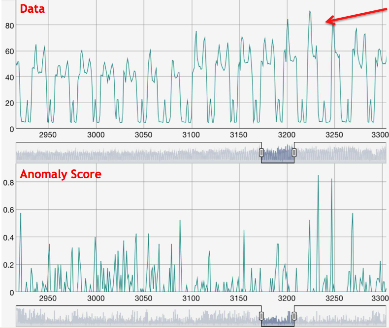

# Anomaly Client Example

This custom client demonstrates how to configure an OPF client with a Numenta's
Cortical Learning Algorithm (CLA) to detect anomalies. The internal model is
constantly generating predictions about the future. The model can be configured
to output an "anomaly score", a value between 0 and 1 which measures the 
discrepancy between the actual input and its predicted value. To configure the 
CLA model to output anomaly scores set the inference type of the model:

	'inferenceType': 'TemporalAnomaly',

Below you can see what the anomaly score looks like for this example, which uses
hourly HotGym energy meter dataset.

* Initially, the anomaly score is very high. This is expected. It happens becuase the model is
still learning the patterns in the dataset. Prior to learning the patterns in the
data, everything seems unfamilar to the model which leads it to output a high 
anomaly score. 

* After the familiarizing itself with the patterns in the data, new and unseen
patterns will trigger a high anomaly score.

* Changes in magnitude, such as unusually high or low activity will also cause the
anomaly score to rise.

An anomaly score above 0.8 is a good indication that an unusual pattern has been
detected.

